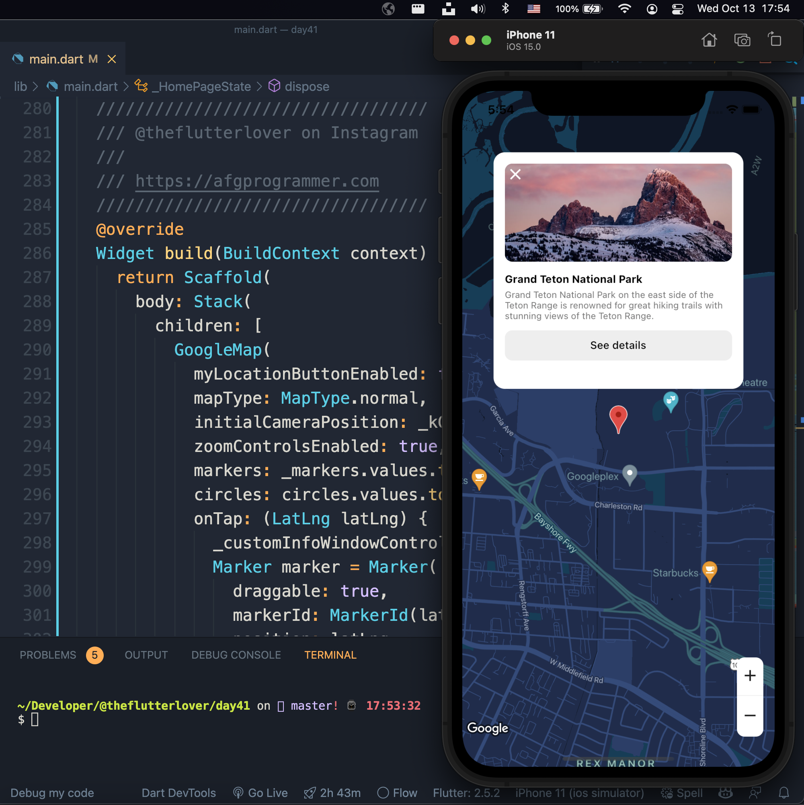
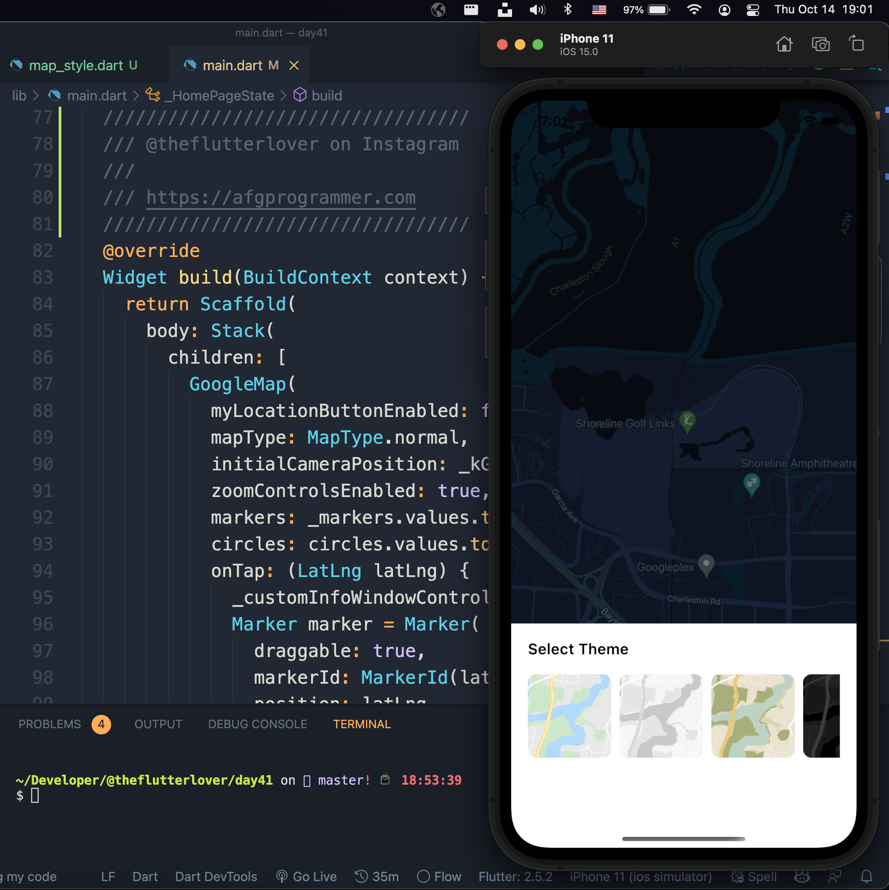
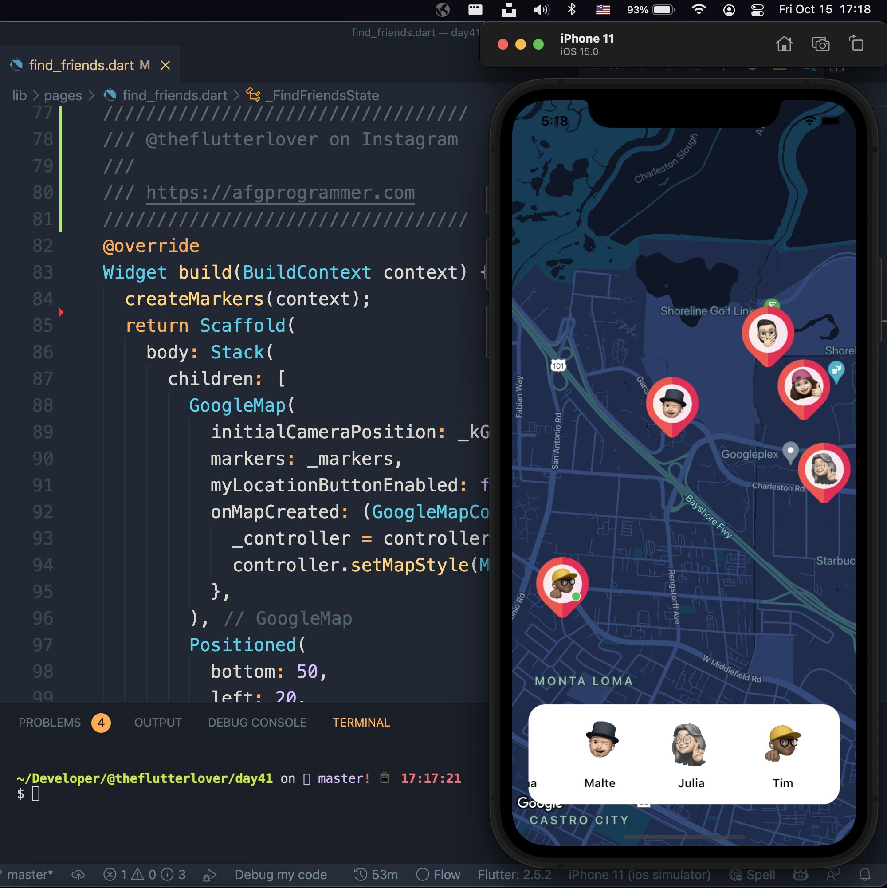
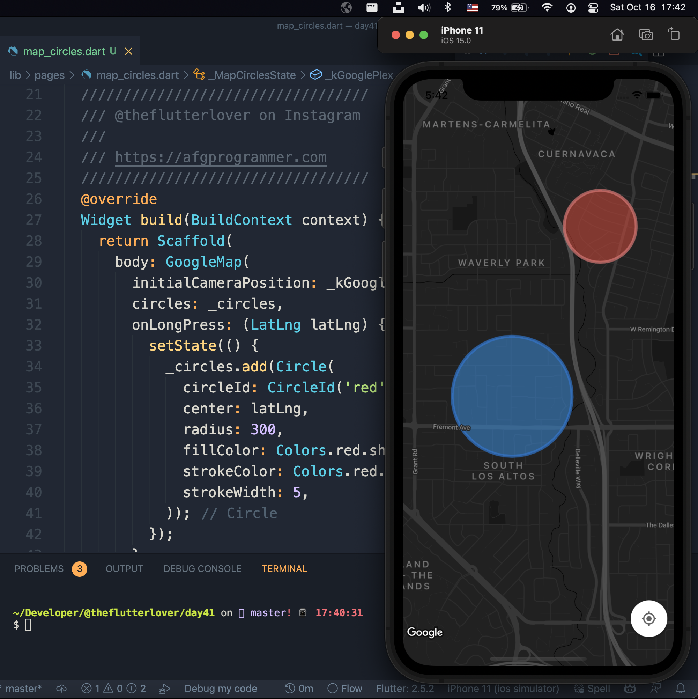

## Flutter Google Map Example

```dart
class Afgprogrammer extends Flutter100DaysOfCode {
  video() {
    return {
      "title": "Flutter Google Map Example",
      "description": "Let’s make a google map application.",
      "day": 41,
    }
  }
}
```


## Development Setup
Clone the repository and run the following commands:
```
flutter pub get
flutter run
```

## Screenshots

### Home Page



### Find Friends Page


### Circles Page

